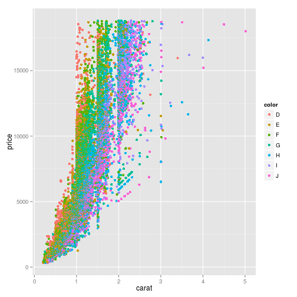
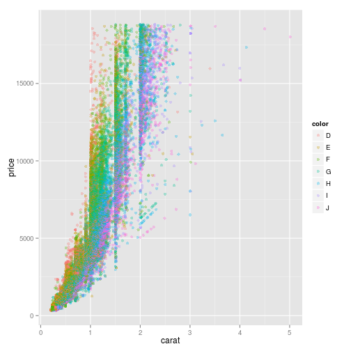
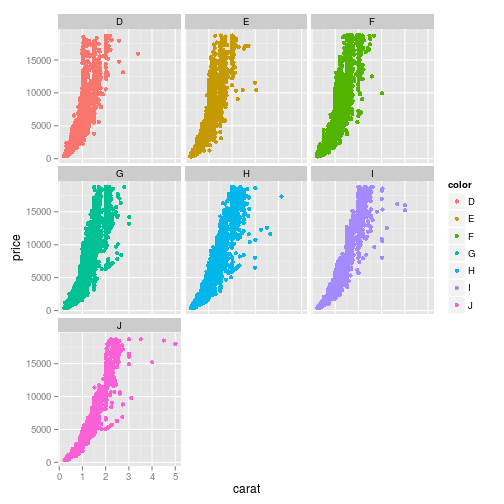

% Hausaufgabe 16
% Landow, Steven <Landow@students.uni-marburg.de>
% 2014-06-11

Falls die Umlaute in dieser und anderen Dateien nicht korrekt dargestellt werden, sollten Sie File > Reopen with Encoding > UTF-8 sofort machen (und auf jeden Fall ohne davor zu speichern), damit die Enkodierung korrekt erkannt wird! 


```
## Error: there is no package called 'ez'
```

```
## Error: there is no package called 'knitcitations'
```


# Die nächsten Punkte sollten beinahe automatisch sein...
1. Kopieren Sie diese Datei in Ihren Ordner (das können Sie innerhalb RStudio machen oder mit Explorer/Finder/usw.) und öffnen Sie die Kopie. Ab diesem Punkt arbeiten Sie mit der Kopie. Die Kopie bitte `hausaufgabe16.Rmd` nennen und nicht `Kopie...`
2. Sie sehen jetzt im Git-Tab, dass die neue Datei als unbekannt (mit gelbem Fragezeichen) da steht. Geben Sie Git Bescheid, dass Sie die Änderungen in der Datei verfolgen möchten (auf Stage klicken).
3. Machen Sie ein Commit mit den bisherigen Änderungen (schreiben Sie eine sinnvolle Message dazu -- sinnvoll bedeutet nicht unbedingt lang) und danach einen Push.
4. Ersetzen Sie meinen Namen oben mit Ihrem. Klicken auf Stage, um die Änderung zu merken.
5. Ändern Sie das Datum auf heute. (Seien Sie ehrlich! Ich kann das sowieso am Commit sehen.)
6. Sie sehen jetzt, dass es zwei Symbole in der Status-Spalte gibt, eins für den Zustand im *Staging Area* (auch als *Index* bekannt), eins für den Zustand im Vergleich zum Staging Area. Sie haben die Datei modifiziert, eine Änderung in das Staging Area aufgenommen, und danach weitere Änderungen gemacht. Nur Änderungen im Staging Area werden in den Commit aufgenommen.
7. Stellen Sie die letzten Änderungen auch ins Staging Area und machen Sie einen Commit (immer mit sinnvoller Message!).
8. Vergessen Sie nicht am Ende, die Lizenz ggf. zu ändern!

# Diamonds are forever 
Bisher haben Sie von mir mehr oder weniger vollständige Analysen bekommen, bei denen Sie im Prinzip nur einzelne Schritte einfügen müssten. Es wird allerdings langsam Zeit, dass Sie eine eigenständige Analyse ausführen. Sie haben das bei der Analyse vom Priming Experiment mittels ANOVA fast gemacht, aber auch da haben Sie viel von mir vorgefertigt bekommen. Für die Aufgaben heute werden Sie den Datensatz `diamonds` aus `ggplot2` bearbeiten. Schauen Sie sich die Beschreibung des Datensatzes an


```r
`?`(diamonds)
```

<div style="border: 2px solid black; padding: 5px; font-size: 80%;">
<!DOCTYPE html PUBLIC "-//W3C//DTD HTML 4.01 Transitional//EN">
<html><head><title>R: Prices of 50,000 round cut diamonds</title>
<meta http-equiv="Content-Type" content="text/html; charset=utf-8">
<link rel="stylesheet" type="text/css" href="">
</head><body>

<table width="100%" summary="page for diamonds"><tr><td>diamonds</td><td align="right">R Documentation</td></tr></table>

<h2>Prices of 50,000 round cut diamonds</h2>

<h3>Description</h3>

<p>A dataset containing the prices and other attributes of
almost 54,000 diamonds. The variables are as follows:
</p>


<h3>Format</h3>

<p>A data frame with 53940 rows and 10 variables</p>


<h3>Details</h3>

 <ul>
<li><p> price. price in US dollars
(\$326&ndash;\$18,823) </p>
</li>
<li><p> carat. weight of the diamond
(0.2&ndash;5.01) </p>
</li>
<li><p> cut. quality of the cut (Fair, Good,
Very Good, Premium, Ideal) </p>
</li>
<li><p> colour. diamond colour,
from J (worst) to D (best) </p>
</li>
<li><p> clarity. a measurement
of how clear the diamond is (I1 (worst), SI1, SI2, VS1,
VS2, VVS1, VVS2, IF (best)) </p>
</li>
<li><p> x. length in mm
(0&ndash;10.74) </p>
</li>
<li><p> y. width in mm (0&ndash;58.9) </p>
</li>
<li><p> z. depth
in mm (0&ndash;31.8) </p>
</li>
<li><p> depth. total depth percentage = z /
mean(x, y) = 2 * z / (x + y) (43&ndash;79) </p>
</li>
<li><p> table. width
of top of diamond relative to widest point (43&ndash;95) </p>
</li></ul>


</body></html>

</div>

Die Aufgabe ist: eine Ausgangsfrage und die darauf folgenden Anschlussfragen statistisch zu beantworten. Sie können auch einige kleinere Fragen als Gruppe behandeln. Sie haben freie Wahl von Methoden und Fragen, aber sie müssen natürlich zueinander passen!

Mögliche Ausgangsfragen sind unter anderem:

* Was bestimmt den Preis eines Diamanten?
* Was bestimmt das Gewicht eines Diamanten? Hat Farbe oder Klarheit eine Auswirkung daruf oder bloß Volumen?
* Gibt es einen Zusammenhang zwischen den verschieden Dimensionen ("Längen")? 
* Gibt es einen Zusammenhang zwischen Farbe und Klarheit? Zwischen Farbe und Carat? Zwischen Farbe und Tiefe?
* ...

*Vergessen Sie dabei nicht, dass wir bisher nur Methoden gelernt haben, wo die abhängige Variable zumindest intervallskaliert ist!*

Sie können sich auch [das *ggplot* Buch](http://dx.doi.org/10.1007/978-0-387-98141-3) zur Inspiration anschauen, v.a. Abbildungen 4.7, 4.8, 4.9, 5.2, 5.3, 5.4, 5.6, 5.14, 7.16, 9.1  und Kapitel 2.2-2.5 könnten inspirierend wirken. Den Code zur Erstellung der Figuren findet man immer im Haupttext.

**Originelle Fragestellungen und Auswertungen werden mit Bonuspunkten belohnt!** 

Hier ein paar Grafiken (auch im Buch zu finden):

```r
ggplot(diamonds, aes(x = carat, y = price, color = color)) + geom_point()
```

 

```r
ggplot(diamonds, aes(x = carat, y = price, color = color)) + geom_point(alpha = 0.3)
```

 

```r
ggplot(diamonds, aes(x = carat, y = price, color = color)) + geom_point() + 
    facet_wrap(~color)
```

 


```r
lm <- lm(price ~ carat * clarity, data = diamonds)
summary(lm)
```

```
## 
## Call:
## lm(formula = price ~ carat * clarity, data = diamonds)
## 
## Residuals:
##    Min     1Q Median     3Q    Max 
##  -8912   -604    -24    533   9459 
## 
## Coefficients:
##                 Estimate Std. Error t value Pr(>|t|)    
## (Intercept)      -2704.0       16.8 -160.77  < 2e-16 ***
## carat             8746.1       18.8  465.72  < 2e-16 ***
## clarity.L         -531.4       65.0   -8.17  3.2e-16 ***
## clarity.Q          470.5       63.7    7.38  1.6e-13 ***
## clarity.C         -926.2       54.5  -17.00  < 2e-16 ***
## clarity^4          693.7       43.1   16.09  < 2e-16 ***
## clarity^5         -514.2       34.6  -14.87  < 2e-16 ***
## clarity^6          166.5       29.5    5.64  1.7e-08 ***
## clarity^7          -24.6       25.7   -0.96     0.34    
## carat:clarity.L   5496.3       68.9   79.73  < 2e-16 ***
## carat:clarity.Q  -1037.8       65.3  -15.90  < 2e-16 ***
## carat:clarity.C   1469.9       59.1   24.88  < 2e-16 ***
## carat:clarity^4   -943.9       51.7  -18.24  < 2e-16 ***
## carat:clarity^5    674.6       45.2   14.92  < 2e-16 ***
## carat:clarity^6    -30.1       39.1   -0.77     0.44    
## carat:clarity^7    304.5       31.6    9.64  < 2e-16 ***
## ---
## Signif. codes:  0 '***' 0.001 '**' 0.01 '*' 0.05 '.' 0.1 ' ' 1
## 
## Residual standard error: 1210 on 53924 degrees of freedom
## Multiple R-squared:  0.909,	Adjusted R-squared:  0.909 
## F-statistic: 3.58e+04 on 15 and 53924 DF,  p-value: <2e-16
```


# Karat/Preis und Clarity/Preis

```r
ANOVA <- aov(price ~ carat, data = diamonds)
ANOVA2 <- aov(price ~ clarity, data = diamonds)
summary(ANOVA)
```

```
##                Df   Sum Sq  Mean Sq F value Pr(>F)    
## carat           1 7.29e+11 7.29e+11  304051 <2e-16 ***
## Residuals   53938 1.29e+11 2.40e+06                   
## ---
## Signif. codes:  0 '***' 0.001 '**' 0.01 '*' 0.05 '.' 0.1 ' ' 1
```

```r
summary(ANOVA2)
```

```
##                Df   Sum Sq  Mean Sq F value Pr(>F)    
## clarity         7 2.33e+10 3.33e+09     215 <2e-16 ***
## Residuals   53932 8.35e+11 1.55e+07                   
## ---
## Signif. codes:  0 '***' 0.001 '**' 0.01 '*' 0.05 '.' 0.1 ' ' 1
```


# Price~Karat*Clarity

```r
ANOVA3 <- aov(price ~ carat * clarity, data = diamonds)
summary(ANOVA3)
```

```
##                  Df   Sum Sq  Mean Sq F value Pr(>F)    
## carat             1 7.29e+11 7.29e+11  501418 <2e-16 ***
## clarity           7 3.91e+10 5.58e+09    3839 <2e-16 ***
## carat:clarity     7 1.19e+10 1.69e+09    1164 <2e-16 ***
## Residuals     53924 7.84e+10 1.45e+06                   
## ---
## Signif. codes:  0 '***' 0.001 '**' 0.01 '*' 0.05 '.' 0.1 ' ' 1
```

# Noch eine Überlegung
Haben Sie dabei explorativ oder konfirmativ gearbeitet? Was hat das für eine Auswirkung auf die Interpretation der Ergebnisse?
  # Bei der Analyse der Daten kann man entweder explorativ oder konfirmatorisch vorgehen. Im ersten Fall sucht man gezielt nach Strukturen, während man im zweiten Fall von einer Hypothese oder mehreren Hypothesen ausgeht, die man überprüfen will. Hierbei wurde dementsprechend explorativ gearbeitet.

# Lizenz
Dieses Werk ist lizenziert unter einer CC-BY-NC-SA Lizenz.
