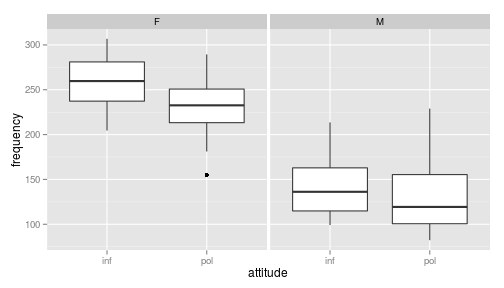
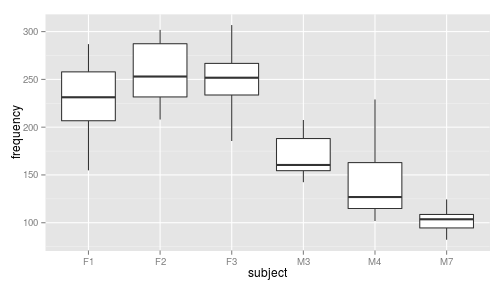
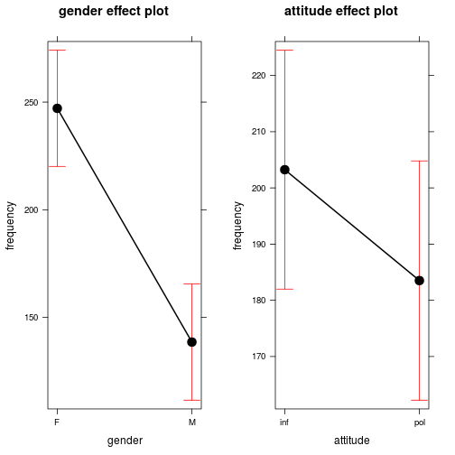

% Hausaufgabe 20
% Landow, Steven <landow@student.uni-marburg.de>
% 2014-06-24

Falls die Umlaute in dieser und anderen Dateien nicht korrekt dargestellt werden, sollten Sie File > Reopen with Encoding > UTF-8 sofort machen (und auf jeden Fall ohne davor zu speichern), damit die Enkodierung korrekt erkannt wird! 


```
## Loading required package: Matrix
## Loading required package: Rcpp
```

```
## Error: there is no package called 'knitcitations'
```


# Die nächsten Punkte sollten beinahe automatisch sein...
1. Kopieren Sie diese Datei in Ihren Ordner (das können Sie innerhalb RStudio machen oder mit Explorer/Finder/usw.) und öffnen Sie die Kopie. Ab diesem Punkt arbeiten Sie mit der Kopie. Die Kopie bitte `hausaufgabe20.Rmd` nennen und nicht `Kopie...`
2. Sie sehen jetzt im Git-Tab, dass die neue Datei als unbekannt (mit gelbem Fragezeichen) da steht. Geben Sie Git Bescheid, dass Sie die Änderungen in der Datei verfolgen möchten (auf Stage klicken).
3. Machen Sie ein Commit mit den bisherigen Änderungen (schreiben Sie eine sinnvolle Message dazu -- sinnvoll bedeutet nicht unbedingt lang) und danach einen Push.
4. Ersetzen Sie meinen Namen oben mit Ihrem. Klicken auf Stage, um die Änderung zu merken.
5. Ändern Sie das Datum auf heute. (Seien Sie ehrlich! Ich kann das sowieso am Commit sehen.)
6. Sie sehen jetzt, dass es zwei Symbole in der Status-Spalte gibt, eins für den Zustand im *Staging Area* (auch als *Index* bekannt), eins für den Zustand im Vergleich zum Staging Area. Sie haben die Datei modifiziert, eine Änderung in das Staging Area aufgenommen, und danach weitere Änderungen gemacht. Nur Änderungen im Staging Area werden in den Commit aufgenommen.
7. Stellen Sie die letzten Änderungen auch ins Staging Area und machen Sie einen Commit (immer mit sinnvoller Message!).
8. Vergessen Sie nicht am Ende, die Lizenz ggf. zu ändern!

*Für diese Hausaufgabe werden Sie auch während der Bearbeitung Internetzugang brauchen, weil die Quellenangaben und Daten dynamisch aus dem Netz runtergeladen werden!*

Ich schlage weiterhin vor, dass Sie die R-Code-Blöcke erst in der Konsole testen und zum Laufen bringen, bevor Sie sie in die Rmd-Datei einfügen. Die Behebung von Fehlern ist einfach leichter in der Konsole *und* bei den Rmd-Dateien wird evtl. alles jedes mal neu berechnet, was bei den Modellen hier evtl. ein paar Minuten dauern könnte. Sparen Sie sich Zeit und testen Sie das Knitten der Rmd-Datei erst, wenn Sie kurz eine Kaffeepause brauchen

Im folgenden steht RE für engl. *random effect* und FE für engl. *fixed effect*.

# Höflichkeit und Stimmhöhe


```

Error in eval(expr, envir, enclos) : konnte Funktion "citet" nicht finden

```

 untersuchten die phonetischen Eigenschaften der formellen und informellen Register im Koreanischen. Unter anderem wurde auch die Grundfrequenz ($F_0$) der Stimme bei jedem Trial festgestellt. Die Daten zur Grundfrequenz bei sechs Probanden und sieben Items hat Bodo Winter im Netz verfügbar gemacht. 

Wir können Daten direkt von seiner Webseite in R laden: 


```r
stimmen <- read.csv("http://www.bodowinter.com/tutorial/politeness_data.csv")
```


Wie immer schauen wir uns erstmal die Zusammenfassung der Daten an.


```r
summary(stimmen)
```

```
##  subject gender    scenario attitude   frequency    
##  F1:14   F:42   Min.   :1   inf:42   Min.   : 82.2  
##  F2:14   M:42   1st Qu.:2   pol:42   1st Qu.:131.6  
##  F3:14          Median :4            Median :203.9  
##  M3:14          Mean   :4            Mean   :193.6  
##  M4:14          3rd Qu.:6            3rd Qu.:248.6  
##  M7:14          Max.   :7            Max.   :306.8  
##                                      NA's   :1
```


Die Items in dieser Studie sind "Szenarien", also Situationen wo man mehr oder weniger höflich ist: obwohl es einen fixen Faktor für Höflichkeit gibt, ist man evtl. nicht in jeder Situation gleich (un)höflich. Somit haben wir einen zufälligen Faktor, weil wir nicht alle möglichen Szenarien austesten können, obgleich wir erkennen, dass das Szenario einen Teil der Varianz erklären kann. `attitude` ist auch ein Faktor mit zwei Stufen `inf` für *informal* und `pol` für *polite*.  Geschlecht spielt eine bekannte Rolle bei Stimmhöhe und wurde demzufolge auch als `gender` mit aufgenommen. Die Messung der Stimmhöhe in Hertz ist eine metrische Variable, die als `frequency` im data frame zu finden ist. 

Allerdings merken wir, dass `scenario` falsch kodiert ist, was wir korrigieren müssen:


```r
stimmen$scenario <- as.factor(stimmen$scenario)
```


## Auswirkung der experimentellen Manipulation
Um einen groben Eindruck zu bekommen, können wir schnell einen Boxplot machen:


```r
ggplot(stimmen) + geom_boxplot(aes(x = attitude, y = frequency)) + # in Subplots nach Geschlecht aufteilen
facet_wrap(~gender)
```

```
## Warning: Removed 1 rows containing non-finite values (stat_boxplot).
```




Wir merken dabei, dass:
1. Männer haben eindeutig tiefere Stimmen, was uns schon davor bekannt war.
2. Der höfliche Register scheint allgemein tiefer zu sein.
3. Dieser Unterschied scheint kleiner bei Männern als bei Frauen zu sein.

Über den bekannten Haupteffekt `gender` hinaus gibt es also zwei weitere fixe Effekte, die wir uns anschauen möchten:
1. Haupteffekt für `attitude`
2. Interaktion für `gender` $\times$ `attitude` 

## Item- und Subject-Varianz

Wir können auf ähnliche Art und Weise ein Plot für die Versuchspersonen und Szenarien erstellen.

Erstellen Sie einen Boxplot für `frequency` nach `subject`, wie oben für `frequency` nach `attitude` gemacht wurde (hier ohne Aufteilung nach Geschlecht). Dieser gibt uns einen Blick in die Varianz innerhalb und zwischen Versuchspersonen. 


```r
ggplot(stimmen) + geom_boxplot(aes(x = subject, y = frequency))
```

```
## Warning: Removed 1 rows containing non-finite values (stat_boxplot).
```




Machen Sie das gleiche für `scenario`. 


```r
ggplot(stimmen) + geom_boxplot(aes(x = scenario, y = frequency))
```

```
## Warning: Removed 1 rows containing non-finite values (stat_boxplot).
```


Gibt es mehr Varianz zwischen Szenarien oder zwischen Versuchspersonen? 

Die Varianz zwischen Versuchspersonen bzw. Szenarien beschreiben wir durch zufällige Effekte. Es gibt offentsichlich einen Unterschied zwischen den verschiedenen Basisfrequenzen der Einzelversuchenpersonen und es scheint auch zwischen den verschiedenen Szenarien einen Unterschied zu geben, d.h. wir haben auf jeden Fall Intercepts in unserer RE-Struktur. Ob wir auch weitere Struktur in der RE-Struktur aufnehmen, schauen wir uns erst später an.

# Fixe Effekte

Wie oben erwähnt, haben wir drei mögliche Effekte, die wir uns anschauen wollen:
1. Haupteffekt für `gender`
2. Haupteffekt für `attitude`
3. Interaktion für `gender` $\times$ `attitude` 

Um die Berechnung im folgenden zu beschleunigen, bleiben wir momentan bei einer Intercepts-Only-RE-Struktur. Weil der Effekt von Geschlecht schon aus der Literatur und dem Alltag bekannt ist, nehmen wir das Model nur mit `gender` als Ausgangspunkt. Wir haben auch vor, Modellvergleiche zu machen, daher setzten wir `REML=FALSE` von Anfang an.


```r
model.gender <- lmer(frequency ~ gender + (1 | subject) + (1 | scenario), data = stimmen, 
    REML = FALSE)
summary(model.gender)
```

```
## Linear mixed model fit by maximum likelihood  ['lmerMod']
## Formula: frequency ~ gender + (1 | subject) + (1 | scenario)
##    Data: stimmen
## 
##      AIC      BIC   logLik deviance df.resid 
##    816.7    828.8   -403.4    806.7       78 
## 
## Scaled residuals: 
##     Min      1Q  Median      3Q     Max 
## -2.4997 -0.5710 -0.0637  0.6023  2.8656 
## 
## Random effects:
##  Groups   Name        Variance Std.Dev.
##  scenario (Intercept) 191      13.8    
##  subject  (Intercept) 410      20.2    
##  Residual             752      27.4    
## Number of obs: 83, groups: scenario, 7; subject, 6
## 
## Fixed effects:
##             Estimate Std. Error t value
## (Intercept)    247.0       13.5   18.32
## genderM       -108.2       17.6   -6.15
## 
## Correlation of Fixed Effects:
##         (Intr)
## genderM -0.651
```


Wie bei normaler Regression werden auch hier kategorische Variablen als Stufen angegeben. Hier gibt es für `genderM` (also für Männer) eine Auswirkung von etwa $-108$ Hz, d.h. die Stimme von Männern sind etwa $108$ Hz tiefer als die von Frauen.

Wir schauen als nächstes den Haupteffekt von `attitude` an:

```r
model.attitude <- lmer(frequency ~ gender + attitude + (1 | subject) + (1 | 
    scenario), data = stimmen, REML = FALSE)
summary(model.attitude)
```

```
## Linear mixed model fit by maximum likelihood  ['lmerMod']
## Formula: frequency ~ gender + attitude + (1 | subject) + (1 | scenario)
##    Data: stimmen
## 
##      AIC      BIC   logLik deviance df.resid 
##    807.1    821.6   -397.6    795.1       77 
## 
## Scaled residuals: 
##    Min     1Q Median     3Q    Max 
## -2.296 -0.646 -0.078  0.545  3.512 
## 
## Random effects:
##  Groups   Name        Variance Std.Dev.
##  scenario (Intercept) 205      14.3    
##  subject  (Intercept) 417      20.4    
##  Residual             637      25.2    
## Number of obs: 83, groups: scenario, 7; subject, 6
## 
## Fixed effects:
##             Estimate Std. Error t value
## (Intercept)   256.85      13.83   18.58
## genderM      -108.52      17.57   -6.18
## attitudepol   -19.72       5.55   -3.56
## 
## Correlation of Fixed Effects:
##             (Intr) gendrM
## genderM     -0.635       
## attitudepol -0.201  0.004
```


Haben sich die Koeffizienten oder Standardfehler geändert?

Jetzt berechen wir das Modell mit der Interaktion zwischen `gender` und `attitude`. 


```r
# model.attitude.int <- CODE_HIER summary(model.attitude.int)
```


Haben sich die Koeffizienten oder Standardfehler geändert?

Ist die Interaktion signifikant? Wir können uns den Koeffizienten anschauen, aber uns interessiert ob *das Model besser geworden ist*. Das testen wir mit `anova()`


```r
# anova(model.attitude,model.attitude.int)
```


Hat die Interkation das Modell verbessert? Wenn ein komplexeres Modell nicht signifikant besser als ein einfacheres Modell ist, bleiben wir bei dem einfacheren Modell! 

# Zufällige Effekte

Wir haben bisher Modelle angeschaut, die nur Intercepts in der RE-Struktur haben. Wie 

```

Error in eval(expr, envir, enclos) : konnte Funktion "citet" nicht finden

```

 betont hat, sollten wir möglichst maximale RE-Strukturen nehmen, sonst haben wir anti-konservative Schätzungen, also erhöhten $\alpha$-Fehler. Hier könnten wir uns vorstellen, dass sich die Probanden nicht nur in ihrer Basistonlage (Intercept) unterscheiden, sondern auch in der Änderung der Tonlage nach Höflichkeit (Slope/Anstieg). Ähnlich können wir uns auch vorstellen, dass manche Szenarien einen größeren Unterschied in der Tonlage zwischen der informellen und der formellen Varianten als bei anderen hervorrufen. Es lohnt sich also, auch Antieg in die RE-Struktur aufzunehmen.


```r
model.attitude.re.slope <- lmer(frequency ~ gender + attitude + (1 + attitude | 
    subject) + (1 + attitude | scenario), data = stimmen, REML = FALSE)
summary(model.attitude.re.slope)
```

```
## Linear mixed model fit by maximum likelihood  ['lmerMod']
## Formula: frequency ~ gender + attitude + (1 + attitude | subject) + (1 +  
##     attitude | scenario)
##    Data: stimmen
## 
##      AIC      BIC   logLik deviance df.resid 
##    814.9    839.1   -397.4    794.9       73 
## 
## Scaled residuals: 
##    Min     1Q Median     3Q    Max 
## -2.195 -0.669 -0.079  0.526  3.425 
## 
## Random effects:
##  Groups   Name        Variance Std.Dev. Corr
##  scenario (Intercept) 182.08   13.49        
##           attitudepol  31.26    5.59    0.22
##  subject  (Intercept) 392.47   19.81        
##           attitudepol   1.71    1.31    1.00
##  Residual             627.88   25.06        
## Number of obs: 83, groups: scenario, 7; subject, 6
## 
## Fixed effects:
##             Estimate Std. Error t value
## (Intercept)   257.99      13.53   19.07
## genderM      -110.80      17.51   -6.33
## attitudepol   -19.75       5.92   -3.33
## 
## Correlation of Fixed Effects:
##             (Intr) gendrM
## genderM     -0.647       
## attitudepol -0.105  0.003
```


Haben sich die Koeffizienten oder Standardfehler (im Vergleich zu `model.attitude` geändert)? 

Hat dieses Modell ein signifikante besseres Fit als `model.attitude`? 


```r
anova(model.attitude, model.attitude.re.slope)
```

```
## Data: stimmen
## Models:
## model.attitude: frequency ~ gender + attitude + (1 | subject) + (1 | scenario)
## model.attitude.re.slope: frequency ~ gender + attitude + (1 + attitude | subject) + (1 + 
## model.attitude.re.slope:     attitude | scenario)
##                         Df AIC BIC logLik deviance Chisq Chi Df Pr(>Chisq)
## model.attitude           6 807 822   -398      795                        
## model.attitude.re.slope 10 815 839   -397      795   0.2      4          1
```


Könnten wir hier ein Intercepts-Only-Modell begründen? 

Wir könnten -- sollten -- uns hier auch das Modell mit `gender` in der RE-Struktur anschauen, aber solche Berechnungen werden sehr schnell für eine Hausaufgabe zu aufwendig. Sie können sich an dieser Stelle schon vorstellen, wie kompliziert die RE-Struktur werden kann. Wir müssten für jeden zufälligen Effekt die maximale berechenbare Struktur finden und die einzelnen Berechnungen können schon ziemlich lange dauern. Das ist ein deutlicher Nachteil dieser Methode.   

(Übrigens: Auch bei den RE-Struktur müssen wir berücksichtigen, ob die Interkation zu einer signifikanten Verbesserung führt. In der Regel nehmen wir allerdings keine RE-Struktur an, die komplexer als unsere FE-Struktur ist. Das heißt, wir schauen nicht, ob die Interaktion in der RE-Struktur was bringt, wenn wir die Interkation nicht in die fixen Effekte aufgenommen haben. )

# CIs und Effects
Auch für gemischte Modelle können wir Konfidenzintervalle berechnen. Der Befehl lautet -- wie bei `lm()` -- `confint()`. Allerdings ist die Berechnung deutlich aufwendiger, weshalb wir hier nur beispielweise sie für das einfachste Modell berechnen:


```r
confint(model.gender)
```

```
## Computing profile confidence intervals ...
```

```
##                2.5 % 97.5 %
## .sig01         5.907  29.56
## .sig02        11.059  42.67
## .sigma        23.458  32.64
## (Intercept)  216.680 277.29
## genderM     -149.086 -67.37
```


`.sigma` ist die Schätzung der Residual-Varianz, die `.sigXX` sind die anderen zufälligen Effekte.  

Das Paket `effects` bietet auch die Möglichkeit an, Konfidenzintervalle und schnelle Grafiken für gemischte Modelle zu berechnen bzw. zu generieren.


```r
library(effects)
```

```
## Loading required package: lattice
## Loading required package: grid
## Loading required package: colorspace
```

```r

effects.attitude <- allEffects(model.attitude)
summary(effects.attitude)
```

```
##  model: frequency ~ gender + attitude
## 
##  gender effect
## gender
##     F     M 
## 247.1 138.6 
## 
##  Lower 95 Percent Confidence Limits
## gender
##     F     M 
## 220.1 111.6 
## 
##  Upper 95 Percent Confidence Limits
## gender
##     F     M 
## 274.1 165.6 
## 
##  attitude effect
## attitude
##   inf   pol 
## 203.2 183.5 
## 
##  Lower 95 Percent Confidence Limits
## attitude
##   inf   pol 
## 182.0 162.2 
## 
##  Upper 95 Percent Confidence Limits
## attitude
##   inf   pol 
## 224.5 204.8
```

```r
plot(effects.attitude)
```

 


Was ist der Unterschied zwischen den Konfidenzintervallen von `confint()` und von `allEffects()`? (D.h., woher kommt der Unterschied?) 

# Intercepts und Slopes

Ich habe am Anfang meiner Erklärung für gemischte Modelle erwähnt, dass wir sie eigentlich als Regression mit Korrektur für die verschiedenen Gruppierungen (Subjects, Items, usw.) betrachten können. Das können wir eigentlich auch direkt am Model sehen, indem wir den Befehl `coef()` nutzen.

Wir schauen uns zuerst ein Intercept-Only-Modell an: 

```r
coef(model.attitude)
```

```
## $scenario
##   (Intercept) genderM attitudepol
## 1       243.5  -108.5      -19.72
## 2       263.4  -108.5      -19.72
## 3       268.1  -108.5      -19.72
## 4       277.3  -108.5      -19.72
## 5       254.9  -108.5      -19.72
## 6       244.8  -108.5      -19.72
## 7       246.0  -108.5      -19.72
## 
## $subject
##    (Intercept) genderM attitudepol
## F1       243.4  -108.5      -19.72
## F2       266.9  -108.5      -19.72
## F3       260.2  -108.5      -19.72
## M3       284.4  -108.5      -19.72
## M4       262.1  -108.5      -19.72
## M7       224.1  -108.5      -19.72
## 
## attr(,"class")
## [1] "coef.mer"
```


Wir sehen, dass das Intercept für jedes `subject` und `scenario` ist, aber die Koeffizienten für die Anstige (`genderM` und `attitudepol`) überall gleich sind und zwar die gleichen, die es als fixe Effekte gibt!  Bei dem Modell mit Anstieg in der RE-Struktur gibt es einen Anstieg für jedes `subject` und `scenario`.


```r
coef(model.attitude.re.slope)
```

```
## $scenario
##   (Intercept) genderM attitudepol
## 1       245.3  -110.8      -20.44
## 2       263.3  -110.8      -15.94
## 3       269.1  -110.8      -20.63
## 4       276.8  -110.8      -16.30
## 5       256.1  -110.8      -19.41
## 6       246.9  -110.8      -21.95
## 7       248.5  -110.8      -23.56
## 
## $subject
##    (Intercept) genderM attitudepol
## F1       243.8  -110.8      -20.68
## F2       266.7  -110.8      -19.17
## F3       260.1  -110.8      -19.60
## M3       285.7  -110.8      -17.92
## M4       264.2  -110.8      -19.34
## M7       227.4  -110.8      -21.77
## 
## attr(,"class")
## [1] "coef.mer"
```


Diese Sichtweise -- Regression + Korrektur pro RE-Gruppierung -- war also nicht so verstellt!

# Bibliographie

```
## Error: konnte Funktion "bibliography" nicht finden
```


# Lizenz
Dieses Werk ist lizenziert unter einer CC-BY-NC-SA Lizenz und muss trotzdem nicht unbedingt als Beispiel verwendet werden.

